# DevOps Intern Final Assessment

[](https://github.com/bluezapus/devops-intern-final/actions/workflows/ci.yml)

**Candidate:** Randy Dwi Prastyo  
**Assessment date:** 18 September 2026

This repository demonstrates an end-to-end DevOps workflow for a containerized NGINX application:

**source → CI → container registry → Nomad deployment → centralized logs**

The project covers Linux automation, containerization, GitHub Actions CI/CD, GHCR publishing, Nomad orchestration with Consul health checks, and centralized logging using Promtail, Loki, and Grafana.

## Architecture

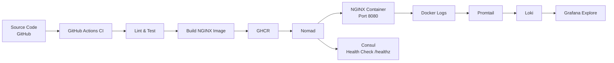

### Pipeline Flow

1. Application and infrastructure source are stored in GitHub.
2. GitHub Actions runs lint, build, and container tests on pushes and pull requests.
3. Successful pushes to `main` publish the image to GitHub Container Registry (GHCR).
4. Nomad pulls the application image and runs it as a service.
5. Consul checks the NGINX `/healthz` endpoint.
6. Promtail discovers the Nomad-managed Docker container and forwards its logs to Loki.
7. Grafana Explore queries the centralized logs with LogQL.

## Repository Structure

```text
devops-intern-final/
├── .github/
│   └── workflows/
│       └── ci.yml
├── app/
│   ├── Dockerfile
│   ├── index.html
│   └── nginx.conf
├── docs/
│   └── screenshots/
├── monitoring/
│   ├── docker-compose.yaml
│   ├── loki-config.yaml
│   ├── loki_setup.md
│   └── promtail-config.yaml
├── nomad/
│   └── nginx-app.nomad.hcl
├── scripts/
│   ├── healthcheck.sh
│   └── sysinfo.sh
├── .gitignore
└── README.md
```

## Prerequisites

The assessment was validated with the following tools installed:

- Git
- Docker Engine and Docker Compose
- Bash
- curl
- ShellCheck
- Hadolint (used by CI)
- HashiCorp Nomad
- HashiCorp Consul

The container image uses the pinned base image `nginx:1.27-alpine`. The monitoring stack also uses versioned Grafana/Loki/Promtail images rather than floating `latest` image tags.

Before deployment, ensure Docker, Nomad, and Consul are running and that the current user can access Docker.

## Quick Start

A clean clone can be started in fewer than ten commands:

```bash
git clone https://github.com/bluezapus/devops-intern-final.git
cd devops-intern-final
docker build --build-arg BUILD_SHA="$(git rev-parse HEAD)" -t devops-nginx:local app/
docker run -d --name devops-nginx -p 8080:8080 devops-nginx:local
./scripts/healthcheck.sh http://localhost:8080/healthz
curl http://localhost:8080/
nomad job validate nomad/nginx-app.nomad.hcl
nomad job run nomad/nginx-app.nomad.hcl
docker compose -f monitoring/docker-compose.yaml up -d
```

> Nomad deployment requires a locally configured Nomad client/server, Consul agent, Docker driver, and access to the GHCR image. Nomad assigns the application a dynamic host port.

---

## Task 1 — Source Control and Repository Workflow

Development was performed incrementally using feature branches and pull requests rather than a single bulk commit.

Branches used during the assessment included:

```text
feature/nginx-app
feature/linux-scripts
feature/containerization
feature/ci-pipeline
feature/nomad-deployment
feature/loki-monitoring
docs/task4-evidence
```

The application was based on the assessment reference NGINX application and adapted for this project. Kubernetes manifests and IDE-specific `.idea` files were not included.

The application page contains the candidate name, assessment date, and build identifier.

Example workflow:

```bash
git checkout -b feature/nginx-app
git add app/
git commit -m "feat: add reference nginx application"
git push -u origin feature/nginx-app
```

Changes were reviewed through GitHub pull requests before being merged into `main`.

---

## Task 2 — Linux and Shell Automation

### System Information Script

`scripts/sysinfo.sh` reports:

- Current user
- Effective UID
- Hostname
- Kernel version
- ISO-8601 date
- Disk usage
- Memory usage
- Docker daemon status

Run:

```bash
./scripts/sysinfo.sh
```

Observed during testing:

```text
=== System Information ===
User: lynx
Effective UID: 1000
Hostname: neuralynx
Docker daemon: running
```

The exact kernel, disk, memory, and timestamp values depend on the host executing the script.

### Application Health Check

The health-check script accepts an optional target URL:

```bash
./scripts/healthcheck.sh http://localhost:8080/healthz
```

A successful request produces:

```text
Checking application health: http://localhost:8080/healthz
Health check passed: HTTP 200
```

A failed request returns a non-zero exit code and prints a diagnostic message.

Both scripts include a shebang and strict shell options and are stored as executable files in Git.

Validate with:

```bash
shellcheck scripts/*.sh
```

---

## Task 3 — Containerization

The application uses the pinned base image:

```dockerfile
FROM nginx:1.27-alpine
```

The image:

- Runs NGINX on port `8080`
- Exposes `8080`
- Provides `/healthz`
- Runs as the non-root `nginx` user
- Includes a Docker `HEALTHCHECK`
- Accepts `BUILD_SHA` as a build argument
- Injects the build identifier into the served page

### Build

```bash
docker build \
  --build-arg BUILD_SHA="$(git rev-parse --short HEAD)" \
  -t devops-nginx:local \
  app/
```

Check image size:

```bash
docker image ls devops-nginx:local
```

### Run

```bash
docker run -d \
  --name devops-nginx \
  -p 8080:8080 \
  devops-nginx:local
```

Test the application:

```bash
curl -i http://localhost:8080/
curl -i http://localhost:8080/healthz
./scripts/healthcheck.sh http://localhost:8080/healthz
```

Verify the runtime user:

```bash
docker exec devops-nginx id
```

### Evidence

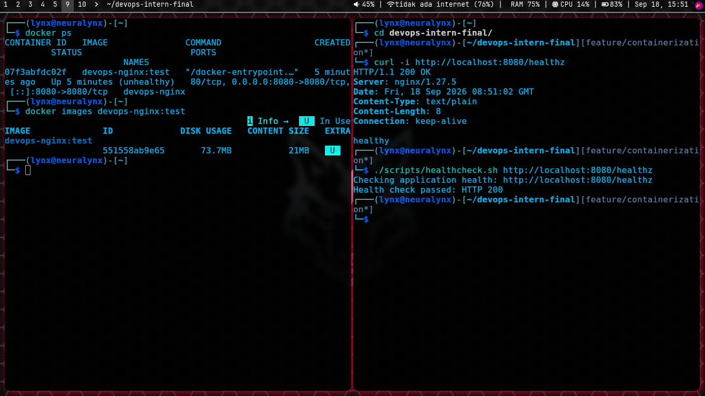

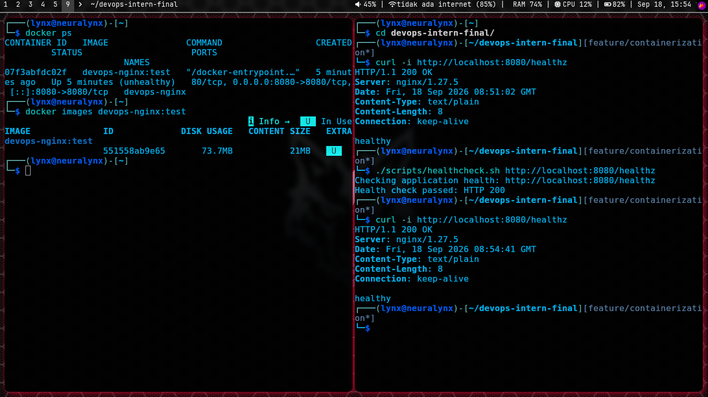

Additional container validation:

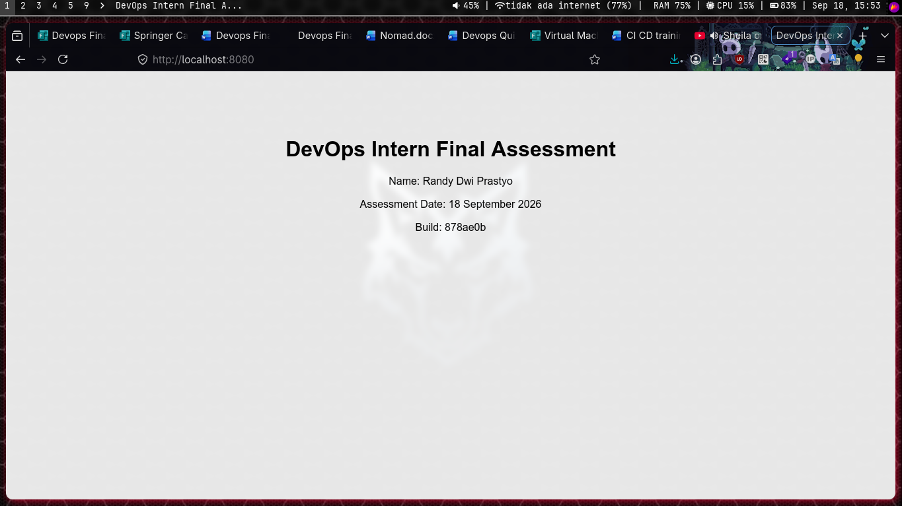

---

## Task 4 — Continuous Integration and Image Publishing

The workflow is defined in:

```text
.github/workflows/ci.yml
```

It runs for pushes and pull requests targeting `main`.

The pipeline contains four stages:

**Lint** validates shell scripts with ShellCheck and the Dockerfile with Hadolint.

**Build** builds the application image and injects the GitHub commit SHA through `BUILD_SHA`.

**Test** starts the container, waits for readiness, and runs the application health check.

**Publish** runs for pushes to `main` and publishes the container to GHCR using the repository `GITHUB_TOKEN`.

The published image uses both commit-SHA and convenience tags:

```text
ghcr.io/bluezapus/devops-intern-final:<commit-sha>
ghcr.io/bluezapus/devops-intern-final:latest
```

For reproducible deployments, a commit-SHA tag can be passed to the Nomad job instead of relying only on `latest`.

### Evidence

Pull request CI:

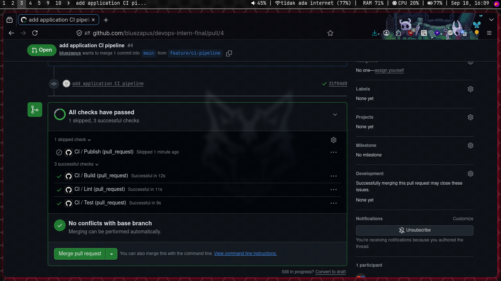

Additional CI validation:

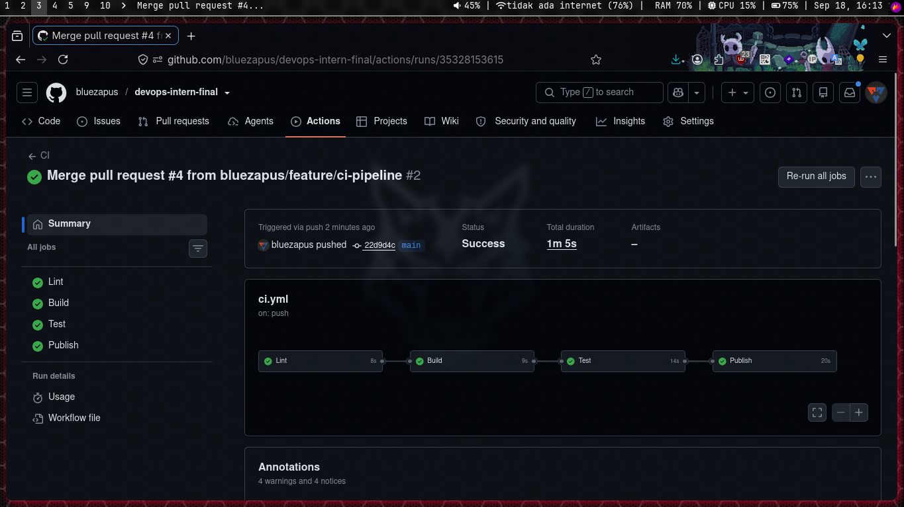

---

## Task 5 — Nomad Deployment and Consul Health Checks

The Nomad job is defined in:

```text
nomad/nginx-app.nomad.hcl
```

The deployment uses:

- Nomad `service` job
- Docker task driver
- Parameterized GHCR image tag
- `100 MHz` CPU
- `64 MB` memory
- Dynamic `http` host port mapped to container port `8080`
- Consul service registration
- HTTP check against `/healthz`
- `10s` health-check interval
- `2s` health-check timeout
- Rolling update with automatic revert
- Restart and reschedule policies

### Validate

```bash
nomad job validate nomad/nginx-app.nomad.hcl
```

Validation completed successfully. Nomad also reported a non-blocking warning that the group defined services without `shutdown_delay`.

### Plan

```bash
nomad job plan nomad/nginx-app.nomad.hcl
```

The plan successfully allocated the task.

For an immutable GHCR deployment, pass a published SHA tag:

```bash
nomad job plan \
  -var="image_tag=<published-commit-sha>" \
  nomad/nginx-app.nomad.hcl
```

### Deploy

```bash
nomad job run \
  -var="image_tag=<published-commit-sha>" \
  nomad/nginx-app.nomad.hcl
```

Check the job:

```bash
nomad job status nginx-app
```

Observed result:

```text
Status      = running

Latest Deployment
Status      = successful
Description = Deployment completed successfully

Deployed
Desired   = 1
Placed    = 1
Healthy   = 1
Unhealthy = 0
```

The validated allocation was running with no restarts and mapped a dynamic host port to `8080`.

### Evidence

Nomad validation:

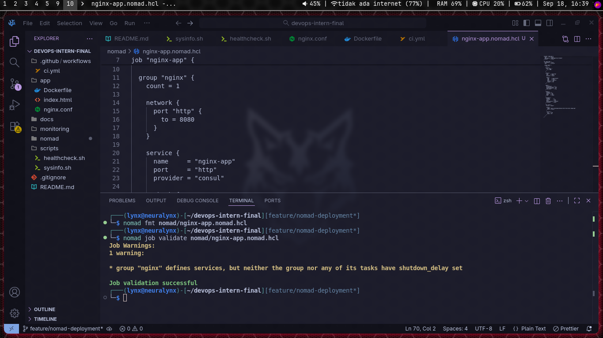

Healthy allocation:

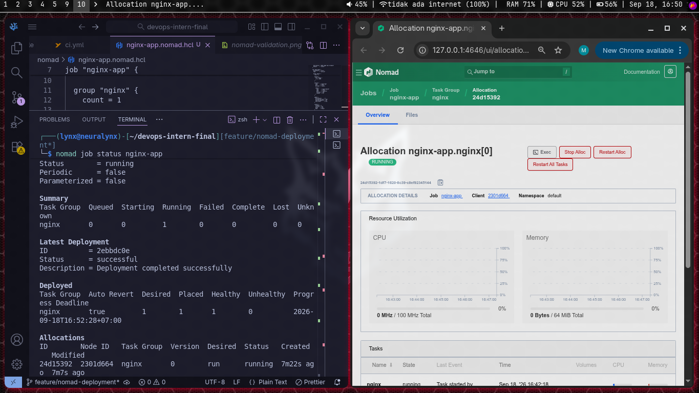

Consul health validation:

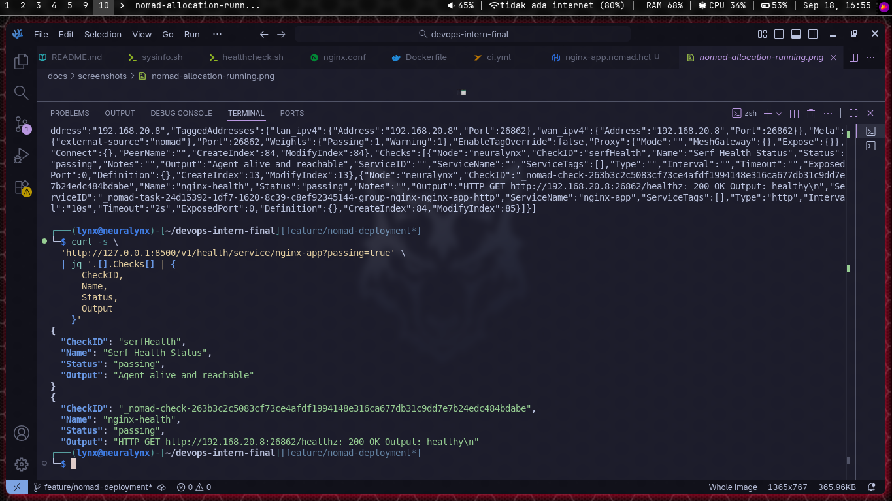

---

## Task 6 — Loki, Promtail, and Grafana

The monitoring configuration is stored under `monitoring/`.

Start the stack:

```bash
docker compose -f monitoring/docker-compose.yaml up -d
```

Check it:

```bash
docker compose -f monitoring/docker-compose.yaml ps
curl -i http://localhost:3100/ready
```

Promtail discovers Docker containers through the read-only Docker socket.

The Nomad-managed NGINX container exposed:

```text
com.hashicorp.nomad.alloc_id
```

Promtail uses that metadata to keep Nomad-managed containers and creates meaningful Loki labels including:

```text
container
job
nomad_alloc_id
service_name
```

The NGINX application is identified with:

```text
job=nginx-app
```

### Generate Access Logs

Find the current dynamic address:

```bash
nomad alloc status <allocation-id>
```

Then generate traffic:

```bash
curl -i http://<nomad-address>/
curl -i http://<nomad-address>/not-found
```

### LogQL

All NGINX application logs:

```logql
{job="nginx-app"}
```

Only HTTP 404 entries:

```logql
{job="nginx-app"} |= "404"
```

Detailed setup and troubleshooting are documented in [`monitoring/loki_setup.md`](monitoring/loki_setup.md).

### Evidence

Monitoring containers:

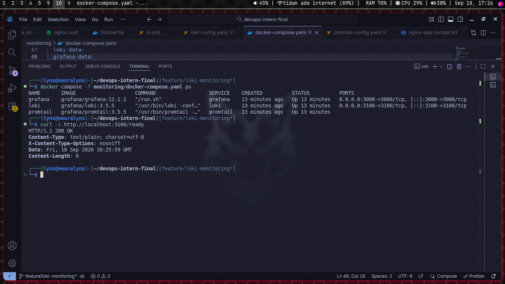

Loki/Grafana validation:

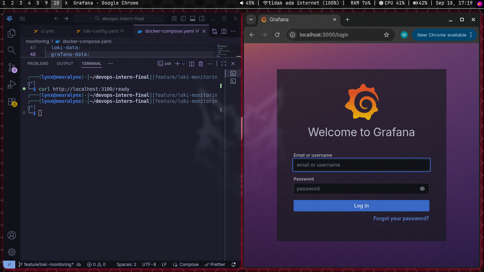

Grafana Explore:

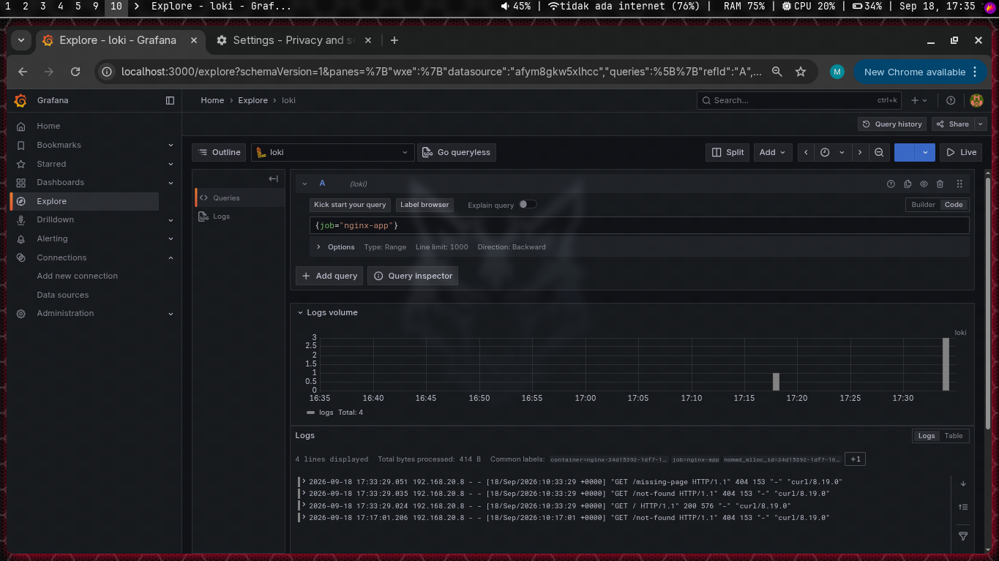

---

## Troubleshooting

The following issues were encountered and resolved during the assessment.

### 1. Git Executable Bit Could Not Be Updated

Running:

```bash
git update-index --chmod=+x scripts/healthcheck.sh
```

initially failed because the new file had not yet been staged.

Resolution:

```bash
git add scripts/healthcheck.sh
git update-index --chmod=+x scripts/healthcheck.sh
```

The executable bit was then stored correctly in Git.

### 2. Consul Detected Multiple Private IPv4 Addresses

Consul initially failed because the host had multiple private IPv4 addresses and it could not automatically choose a bind address.

The Consul agent configuration was updated with an explicit `bind_addr` appropriate for the host.

### 3. Consul Could Not Access Its Data Directory

Consul later reported:

```text
failed to setup node ID: mkdir /opt/consul: permission denied
```

The Consul data directory was created and ownership was assigned to the Consul service account before restarting the service.

### 4. Nomad Agent Had No Operating Mode

Nomad initially reported:

```text
Must specify either server, client or dev mode for the agent.
```

The local Nomad configuration was updated to enable a single-node server and client for the assessment environment.

### 5. Loki Was Temporarily Not Ready

Immediately after startup:

```text
Ingester not ready: waiting for 15s after being ready
```

This was Loki's startup initialization period. Retrying the readiness endpoint after several seconds succeeded.

### 6. Promtail Did Not Receive a Nomad Job-Name Label

The first Promtail configuration expected a Nomad job-name Docker label. Inspection showed that the container exposed only the Nomad allocation ID.

The scrape configuration was changed to identify Nomad-managed containers by `com.hashicorp.nomad.alloc_id`, preserve the allocation as `nomad_alloc_id`, and assign the application `job` label explicitly.

---

## Known Limitations

This repository is designed as a single-node assessment/lab environment rather than a production cluster. Nomad and Consul require host-level installation and configuration before the job can be deployed. The Nomad host port is dynamically allocated, so the application address must be discovered after deployment. The monitoring configuration mounts the Docker socket read-only into Promtail, which is convenient for a local lab but should be reviewed carefully for production security. Loki uses local filesystem storage rather than production object storage.

The Nomad image variable supports immutable SHA tags, while `latest` remains available as a convenience tag from CI. Production deployments should use a specific published SHA tag.

## Final Verification

Before submission, verify from a clean clone:

```bash
git clone https://github.com/bluezapus/devops-intern-final.git
cd devops-intern-final
shellcheck scripts/*.sh
docker build --build-arg BUILD_SHA="$(git rev-parse HEAD)" -t devops-nginx:verify app/
docker run -d --name devops-nginx-verify -p 8080:8080 devops-nginx:verify
./scripts/healthcheck.sh http://localhost:8080/healthz
nomad job validate nomad/nginx-app.nomad.hcl
docker compose -f monitoring/docker-compose.yaml config
```

After successful verification, the final repository state is tagged:

```bash
git tag -a v1.0.0 -m "DevOps Intern Final Assessment"
git push origin v1.0.0
```

## Submission

Repository:

```text
https://github.com/bluezapus/devops-intern-final
```

Final release tag:

```text
v1.0.0
```
